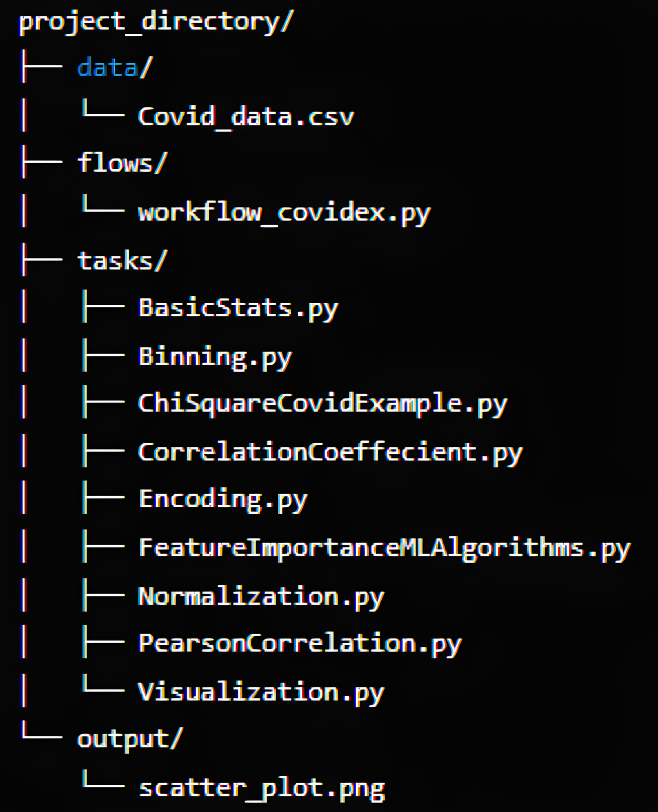
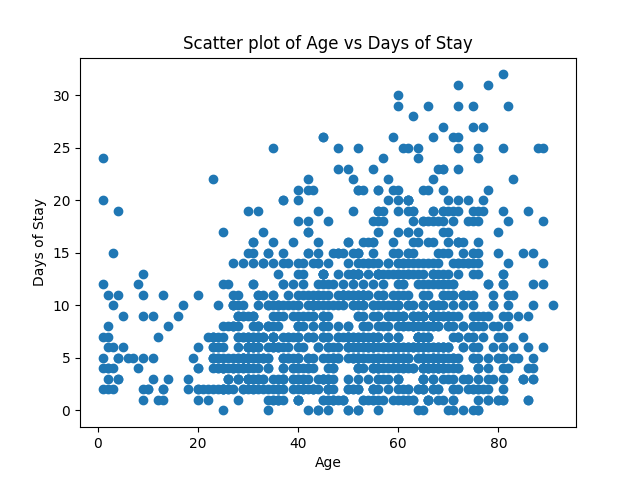

# DSP
Sample demo for [Prefect](https://www.prefect.io/) (https://www.prefect.io/)

### File Structure


### Pre-requisites
1. 
```
pip install -U prefect
```
2. Run Prefect on the Cloud  [Hosted on AWS]
prefect cloud login [Log in with a browser]

OR

Run prefect locally -> ```prefect server start```

### Reference URL

Tutorial - https://docs.prefect.io/latest/tutorial/

### Output


